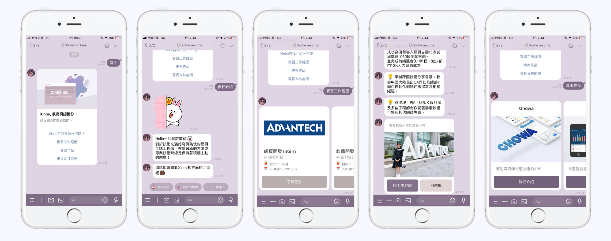

# Xinhe on Line Chatbot
> 2019 LINE TechFresh Internship - Pretest <br />
> LINE chatbot with Node.js



- JavaScript Finite State Machine
- EsLint extends Airbnb style guide
- Babel and Webpack4

## Getting Started
1. Installation.
    ```
    cd xinhe-linebot/
    npm install
    ```
2. Add `.env` file.
    ```
    PORT=3000
    CHANNEL_ID='channel ID'
    CHANNEL_SECRET='channel secret'
    CHANNEL_ACCESS_TOKEN='channel access token'
    ```
3. Start developing.
    ```
    npm start
    ```
4. My LINE chatbot server is now running at http://localhost:3000